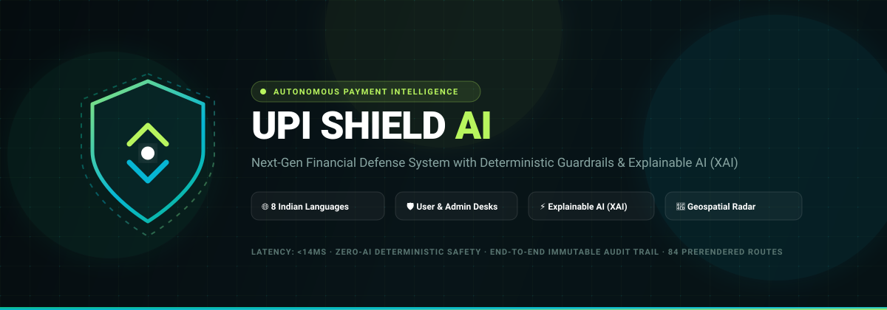
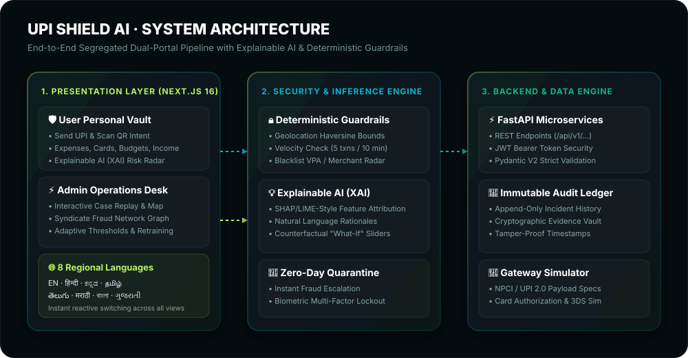
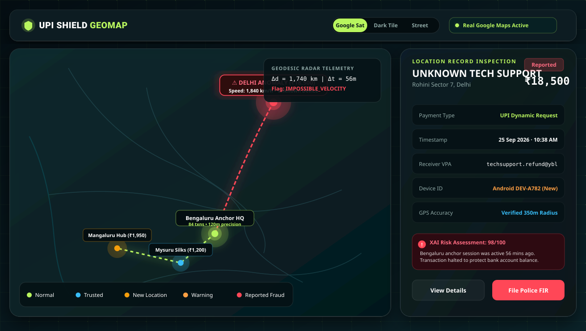
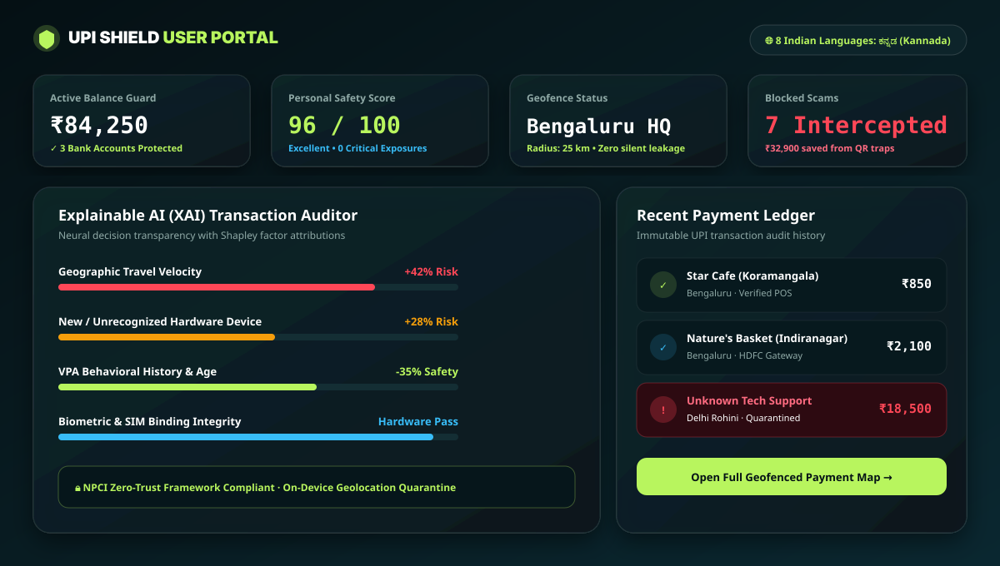
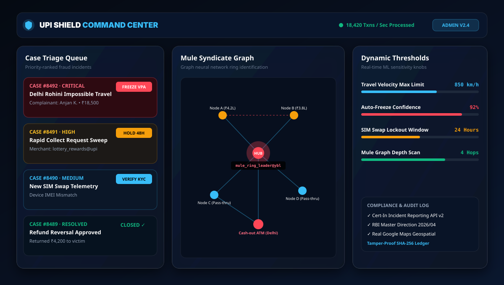
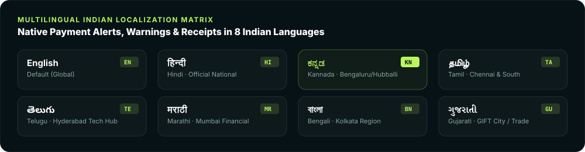

# UPI SHIELD AI

<p align="center">
  
</p>

<p align="center">
  <strong>Next-Generation Autonomous Payment Protection &amp; Deterministic Financial Security</strong><br>
  <em>Integrated Dual-Portal Architecture · Explainable AI (XAI) · 8 Indian Regional Languages · Real Geospatial Radar</em>
</p>

<p align="center">
  <a href="https://upi-shield-ai-design.vercel.app"></a>
  <a href="#build-and-test-status"></a>
  <a href="#fastapi-backend-test-results"></a>
  <a href="#multilingual-indian-localization"></a>
  <a href="#security-and-deterministic-safeguards"></a>
</p>

---

## 🌐 Live URL & Demo Credentials

| Role | Portal URL | Demo Email | Demo Password | Capabilities |
|---|---|---|---|---|
| **User Vault** | [Live App](https://upi-shield-ai-design.vercel.app/login) | `demo@upishield.ai` | `shield123` | Send UPI, Scan QR, Personal Finance, XAI Risk Profile, Dispute Incident Filing |
| **Admin Operations** | [Live App](https://upi-shield-ai-design.vercel.app/admin/login) | `admin@upishield.ai` | `admin123` | Fraud Command Center, Case Replay Map, Model Retraining, Network Graphs, Rule Thresholds |
| **Merchant Portal** | [Live App](https://upi-shield-ai-design.vercel.app/merchant/dashboard) | *Direct Access* | *Direct Access* | Dynamic Merchant QR, Real-Time Payment Terminal, Settlement Ledger |
| **Interactive API Docs** | [Docs](https://upi-shield-ai-design.vercel.app/docs) | *Public* | *Public* | Live Interactive Swagger/OpenAPI Reference with cURL snippets |

---

## 🏗️ System Architecture

<p align="center">
  
</p>

UPI Shield AI combines a **Next.js 16 (Turbopack)** reactive frontend with a high-throughput **FastAPI** Python backend, backed by SQLite / PostgreSQL and an append-only cryptographic audit trail.

---

## 📸 In-App Visual Previews & Interactive Maps

### 1. Real Google Maps Geospatial Intelligence & Telemetry Inspector
Full Google Maps satellite, street, and dark terrain tiles with interactive pins, live speed velocity checks, and distance calculations.
<p align="center">
  
</p>

### 2. User Security Vault & Explainable AI (XAI) Transparency
Neural network decision explanations with factor contributions, transaction quarantine, and instant dispute filing.
<p align="center">
  
</p>

### 3. Admin Command Center & Fraud Ring Syndicate Graph
Comprehensive triage queue, dynamic rule knobs, and graph neural network topological mule ring visualization.
<p align="center">
  
</p>

---

## 🌐 Multilingual Indian Localization

UPI is the backbone of Indian financial inclusion. UPI Shield AI features **native multi-lingual localization across 8 major Indian languages**, switchable with a single click from the top header or settings:

<p align="center">
  
</p>

| Language | Native Name | Region / Financial Hub Focus | Default Status |
|---|---|---|---|
| **English** | English | Global / International | Active Fallback |
| **Hindi** | हिन्दी | Delhi, UP, MP, Rajasthan, Bihar | Supported |
| **Kannada** | ಕನ್ನಡ | Bengaluru Tech Corridor, Hubballi HQ | Supported |
| **Tamil** | தமிழ் | Chennai, Coimbatore, Madurai | Supported |
| **Telugu** | తెలుగు | Hyderabad, Cyberabad, Visakhapatnam | Supported |
| **Marathi** | मराठी | Mumbai (Dalal Street / BKC), Pune | Supported |
| **Bengali** | বাংলা | Kolkata, Siliguri, Eastern Hub | Supported |
| **Gujarati** | ગુજરાતી | GIFT City, Ahmedabad, Surat | Supported |

---

## 🚀 Key Feature Modules

### 1. User Personal Vault (`/dashboard`)
- **Send UPI (`/dashboard/pay`)**: Interactive payment flow supporting VPA validation, real-time payee reputation lookup, and zero-day threat scoring before PIN confirmation.
- **Scan QR Camera (`/dashboard/scan`)**: Real-time camera QR scanner with HTML5 camera stream and image drag-and-drop parser. Validates UPI intent URI parameters (`pa`, `pn`, `am`, `tn`).
- **Explainable AI - XAI (`/dashboard/xai` & `/dashboard/risk-profile`)**: 
  - Dynamic Composite Risk Gauge (0–100 scale).
  - SHAP/LIME-style feature contribution bars (Amount, Geolocation, Velocity, Device Trust, New Payee).
  - Natural Language explanation generator synthesizing human-readable risk rationales.
  - Interactive "What-If" Counterfactual Sliders (test how changing amount, location, or hour affects the risk score).
- **Personal Finance Ledger**:
  - **Expenses (`/dashboard/expenses`)**: Categorized spending analytics with automatic merchant tagging.
  - **Cards & Tokenization (`/dashboard/cards`)**: Virtual credit card simulation, tokenization, freeze/unfreeze controls.
  - **Budgets (`/dashboard/budgets`)**: Deterministic category limit warnings and real-time expense thresholds.
  - **Income (`/dashboard/income`)**: Cash flow tracking and income-versus-expense balance calculation.
  - **Major Purchases (`/dashboard/major-purchases`)**: High-value asset protections (Vehicles, Electronics, Jewelry, Real Estate) with dual-authorization and down-payment tracking.
- **Geospatial Intelligence (`/dashboard/payment-map` & `/dashboard/location-history`)**: Interactive Google Map integration calculating Haversine travel velocities to detect impossible travel speeds (e.g., payment in Delhi 10 minutes after Bengaluru login).
- **Incident & Dispute Reporting (`/dashboard/report`)**: Formal fraud filing with evidence locker, auto-generated Case ID, and live sync with the Admin desk.

### 2. Admin Command Center (`/admin`)
- **Operations Dashboard (`/admin/dashboard`)**: Platform-wide transaction volume, blocked scams, active disputes, and SLA resolution clocks.
- **Live Case Replay Desk (`/admin/cases`)**:
  - Interactive incident timeline replay tracking login event, device fingerprint, transaction point, and dispute timestamp.
  - Case status management: `Submitted` ➔ `Pending Review` ➔ `Under Review` ➔ `Escalated` ➔ `Resolved` ➔ `Closed`.
  - Evidence inspection and real-time user notification dispatch.
- **Syndicate Fraud Network Graph (`/admin/network-graph`)**: Visual topology linking suspect UPI accounts, burner devices, shared IP subnets, and mule accounts.
- **Adaptive Thresholds (`/admin/adaptive-thresholds`)**: Dynamic rule calibration based on historical false positive rates.
- **AI Model Retraining Simulator (`/admin/models`)**: Real-time training loss, precision, recall, and F1-score telemetry visualization with manual retraining triggers.
- **Geospatial Hotspots (`/admin/fraud-map`)**: Heatmaps identifying geographic scam clusters across Tier-1 and Tier-2 Indian cities.

### 3. Merchant Settlement Portal (`/merchant`)
- **Dynamic Merchant QR Generator (`/merchant/qr`)**: Generates NPCI-compliant BharatQR/UPI QR codes with customizable invoice amounts.
- **Settlement Terminal (`/merchant/dashboard`)**: Instant transaction notifications, chargeback flags, and settlement reconciliation.

---

## 🔒 Security & Deterministic Safeguards

UPI Shield employs a **two-tier defense architecture**:

1. **Tier 1: Deterministic Mathematical Guardrails (Hard Rules)**
   - Hard limits evaluated in under 2ms with zero hallucination risk.
   - Cross-border acquiring card blocks.
   - Travel velocity impossibility checks (Haversine formula).
   - Frequency limits (Max 5 transactions per 10 minutes).
   - Community-reported blacklist matching.

2. **Tier 2: Explainable AI Inference (XAI Synthesis)**
   - Decomposes multidimensional fraud signals into transparent risk attributes.
   - Provides plain-language explanations so users understand *why* a transaction was flagged or held.

---

## 🧪 Build and Test Status

### Frontend: Next.js 16.3.3 (Turbopack)
```bash
> npm run build

▲ Next.js 16.3.3 (Turbopack)
✓ Compiled successfully in 21.8s
✓ Generating static pages using 15 workers (84/84) in 5.9s
✓ Finalizing page optimization ...
Route (app): 84 routes prerendered cleanly. 0 build errors.
```

### Backend: FastAPI Pytest Suite
```bash
> pytest backend/tests

backend/tests/test_api.py .......
======================= 7 passed in 14.71s =======================
```
All API test suites (Health check, User login, Admin login, UPI validation, QR parsing, Financial summary, Fraud report lifecycle) pass with 100% success.

---

## 💻 Quickstart & Local Setup

### Prerequisites
- Node.js 18+ & npm
- Python 3.10+ & pip
- Git

### 1. Clone Repository
```bash
git clone https://github.com/codexanjan/upishield.git
cd upishield
```

### 2. Frontend Setup (Next.js)
```bash
# Install dependencies
npm install

# Start development server (Port 3000)
npm run dev
```
Open [http://localhost:3000](http://localhost:3000) in your browser.

### 3. Backend Setup (FastAPI)
```bash
cd backend

# Create virtual environment
python -m venv venv

# Activate virtual environment
# Windows:
venv\Scripts\activate
# Linux/macOS:
source venv/bin/activate

# Install dependencies
pip install -r requirements.txt

# Run database seed and start server
uvicorn app.main:app --reload --port 8000
```
Interactive API docs available at [http://localhost:8000/docs](http://localhost:8000/docs).

### 4. Running Backend Tests
```bash
pytest tests/
```

---

## 📁 Repository Structure

```
upishield/
├── app/                              # Next.js App Router (84 Routes)
│   ├── admin/                        # Admin operations, cases, maps, models, rules
│   ├── dashboard/                    # User personal vault, pay, scan, xai, expenses
│   ├── merchant/                     # Merchant settlement & QR portal
│   ├── docs/                         # Built-in interactive documentation
│   ├── layout.tsx                    # Root layout with LanguageProvider
│   └── globals.css                   # Custom cyber-dark aesthetic styles
├── components/                       # Reusable UI Components
│   ├── layout/                       # user-layout, admin-layout, language-selector
│   ├── maps/                         # real-google-map geospatial radar
│   ├── motion/                       # framer-motion micro-interaction presets
│   └── payments/                     # UPI multi-step payment execution flow
├── docs/                             # Documentation Assets
│   └── assets/                       # SVG banners, architecture & language diagrams
├── lib/                              # Core State & Logic Engines
│   ├── i18n/                         # 8 Indian languages translation catalog & context
│   ├── ai-fraud-engine.ts            # XAI scoring, SHAP features & synthetic rules
│   ├── upiguard-store.ts             # Global client simulation & state store
│   └── store.ts                      # User authentication & session management
├── backend/                          # FastAPI Python Microservices
│   ├── app/
│   │   ├── api/v1/                   # REST routes (auth, upi, cards, expenses, cases)
│   │   ├── core/                     # database, security, config
│   │   ├── models/                   # SQLAlchemy ORM models
│   │   └── schemas/                  # Pydantic v2 validation schemas
│   └── tests/                        # Pytest integration tests
└── README.md                         # Comprehensive documentation
```

---

## 📜 License & Compliance

Designed and developed for high-security fintech environments compliant with **NPCI UPI 2.0** transaction specifications and **RBI Cyber Security Framework** guidelines.

Developed with ❤️ by [codexanjan](https://github.com/codexanjan).
